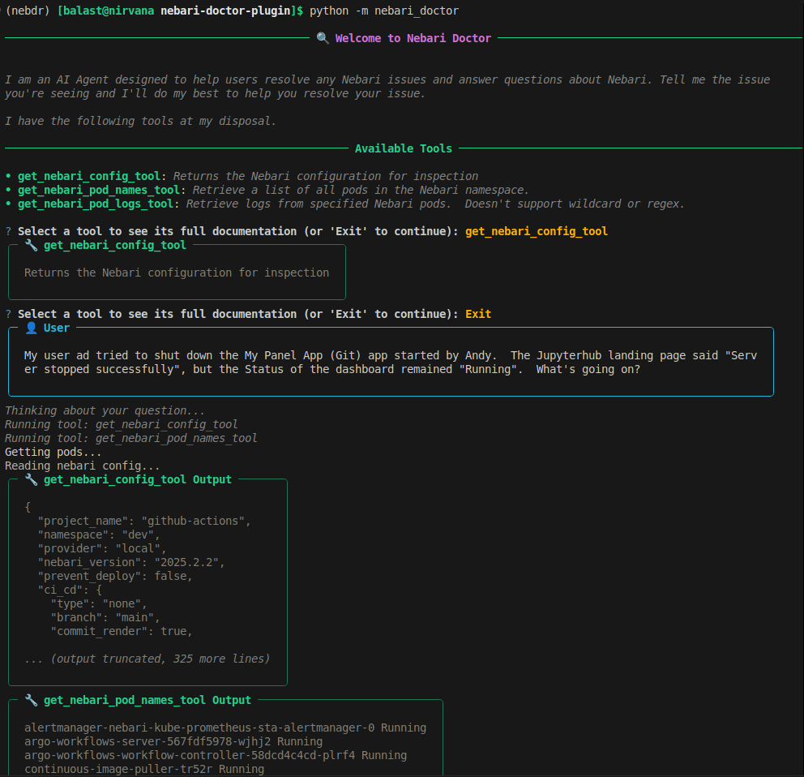
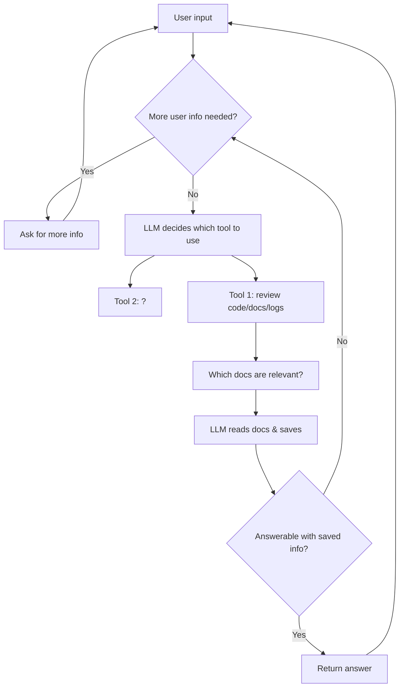

#  Nebari Doctor

This plugin uses an AI agent to attempt to diagnose your issue with Nebari. 



# Set up the environment
run the following from top level dir
```bash
conda env create -f environment.yaml
conda activate pydantic-ai-demo
pip install -e .
python -m nebari_doctor
```

# Run the Demo
Run the demo with `python -m nebari_doctor`

# How it works
Build a nebari doctor LLM functionality
- user describe issues
- LLM gets context:
    - pod logs (1.5M+ words)
    - code base (260K words)
    - nebari docs (224K words)
        - FAQ
    - search/look at open github issues
    - search/look at discussions
- system prompt describes Nebari, tell user what is wrong

Too many words for most LLMs context so, we'll have an agent assess which pod logs it thinks are going to be most useful or look at all sequentially and assess if they look useful or not.

# Agent Workflow
- User enters issue they are seeing
- LLM decides whether more info is needed from user or if the issue is clear enough to start looking at logs.  If more info needed from user, then ask for more and then repeat this step.
- LLM decides which logs are likely relevant and fit in context limit
- LLM reads these logs and saves relevant logs to memory
- LLM assesses whether it can answer the question with the saved logs, or whether more logs or user interaction may be useful.
- If more logs or user interaction is needed go to the 2nd bullet point.
- Otherwise return the answer to the user and allow the user to continue chatting if needed.



Currently, it only is an example of how it might work.  Pretend that you just hit the issue and you immediately ask the question that is auto fed in when running nebari doctor.  The last few minutes of the logs is available for the agent, and it explains what it sees.