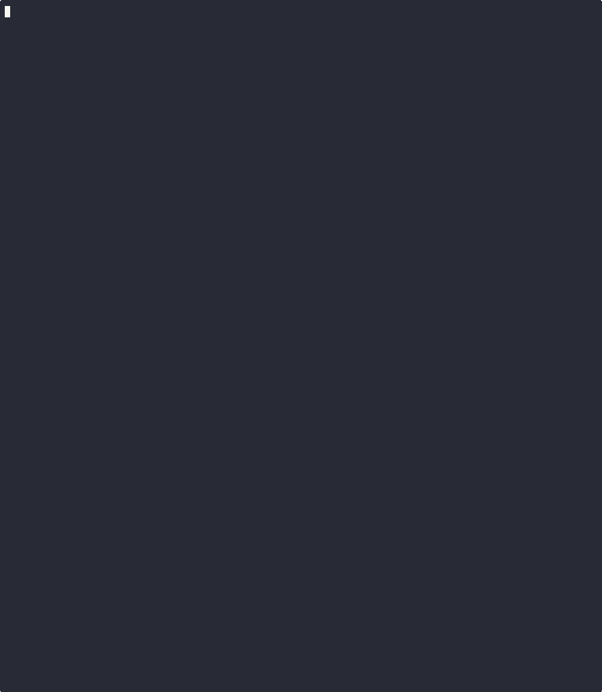

#  Nebari Doctor

This plugin uses an AI agent to attempt to diagnose your issue with Nebari by using various tools including:
- referencing the nebari docs
- reading pod logs
- reading nebari config file



# Install Nebari Doctor
```bash
pip install nebari_doctor
```

# How to use
```bash
- Deploy Nebari
- [Set up kubectl access](https://www.nebari.dev/docs/how-tos/debug-nebari/#generating-the-kubeconfig)
- Set `OPENAI_API_KEY` env var locally
- nebari doctor -h
- nebari doctor -c nebari-config.yaml
```

# Features
- 🤖 AI-powered diagnostics for Nebari issues
- 🎨 Beautiful, color-coded interface for easy reading
- 🔍 Intelligent analysis of pod logs and configuration
- 💬 Interactive chat experience with the diagnostic agent

# Development
## Set up the environment
Run the following from top level dir:
```bash
conda env create -f environment.yaml
conda activate nebari-doctor
pip install -e .
```
